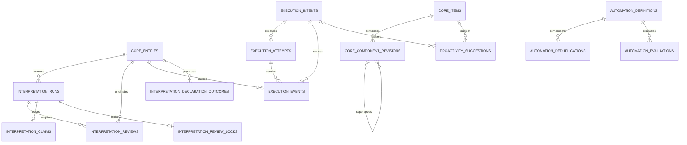

# Database

PostgreSQL 18.4 is the sole complete durable runtime store. One bounded pool is shared by functional adapters and inference telemetry; application startup checks connectivity and the required migration level before HTTP or workers start.

## Functional schema

### Knowledge and interpretation

| Table | Purpose |
| --- | --- |
| `core_entries` | Immutable user or connector input, with external-origin idempotency. |
| `core_items` | Stable identity and optional versioned Profile. |
| `core_component_revisions` | Immutable, evidence-backed Component values and supersession history. |
| `core_states` | Persisted observed, believed, desired, required, forbidden or predicted State. |
| `interpretation_runs` | Interpretation history, retries and queue availability. |
| `interpretation_claims` | Independent worker claim identity and renewable lease. |
| `interpretation_reviews` | Generic `referenceResolution` questions and their decisions. |
| `interpretation_review_locks` | Durable mutual exclusion while the final Review publishes an Interpretation. |
| `interpretation_declaration_outcomes` | Idempotent result of each interpreted Item, State, Automation or Intent declaration. |

Planning does not have separate task, objective, plan or habit tables. Each planning entity is an `core_items` row whose Profile is `task`, `objective`, `plan` or `habit`; its lifecycle, temporal data, dependencies and progress are versioned Components.

### State, automations and execution

| Table | Purpose |
| --- | --- |
| `automation_definitions` | Given/When/Then Automation definition plus its current runtime cursor. |
| `automation_deduplications` | Durable occurrence and trigger idempotency for Automations. |
| `automation_evaluations` | Explainable history of Automation evaluations and produced Intent ids. |
| `execution_intents` | Conditional request to invoke a versioned Capability. |
| `execution_attempts` | Capability invocation attempts, ordered per Intent and sharing a stable idempotency key across retries. |
| `execution_events` | Immutable outcomes or occurrences with explicit causation. |

Automations only produce Intents. Attempts and Events remain separate so an uncertain external result can be represented without claiming that an action succeeded.

### Suggestions

| Table | Purpose |
| --- | --- |
| `suggestions` | Explainable detector finding, autonomy decision, feedback and optional Intent. |

There is no notification table. Scheduling uses `automation_definitions`; launcher reads derive delivered, unacknowledged notices from Intents and Events.

The in-process mutation approval registry is not persisted. Its entries contain executable callbacks and cannot be safely restored after a restart until proposal application has a durable command contract.

Interpretation Policies are code-owned operation definitions rather than functional data. They have
no table and cannot be changed through Entries, connectors, or the HTTP API.

## Storage decisions

- Domain identities remain `text`; the domain does not require UUID-formatted ids.
- Timestamps use `timestamptz` and temporal ranges enforce `from < to` when both ends exist.
- Statuses and modalities use checked `text`, matching the closed unions in the domain.
- `JSONB` is limited to recursive domain values such as Conditions, evidence, triggers, policies and adapter payloads. These structures are validated again by domain rehydration.
- Frequently queried fields remain relational columns and have targeted indexes: queue leases, Profiles, Component lookup, due Automations, event keys, Intent status and Suggestion fingerprints.
- Foreign keys use restrictive deletion for immutable domain history. Cascades are limited to runtime support rows that have no independent meaning.
- `telemetry.runs` remains in the separate `telemetry` schema and is not part of functional state.
- `pgmigrations` is migration-runner metadata and is intentionally omitted from the model.

## Migration baseline

- `001_system.sql` creates the complete functional schema.
- `002_telemetry.sql` creates only inference telemetry.
- The baseline requires an empty database without a `pgmigrations` history.
- Later schema changes are append-only starting at `003`.

Legacy `concepts`, `predicates`, `axioms`, `aliases`, `links`, Reminders and request-kind tables are absent. Their current responsibilities belong to generic Items, Components, States, Automations and Intents.

## Verification and readiness

`npm run test:postgres` and `npm run test:http` create temporary loopback-only PostgreSQL 18.4 clusters through `embedded-postgres`. The harness generates its own connection target, never reads the configured application database, applies both repository migrations, closes pools and the child process, and removes only its owned temporary directory.

`/api/health` reports process liveness. `/api/ready` verifies database connectivity and that `001_system` plus `002_telemetry` are present; workers do not start until the same check passes. Railway runs migrations before deployment and uses readiness as its healthcheck path.
