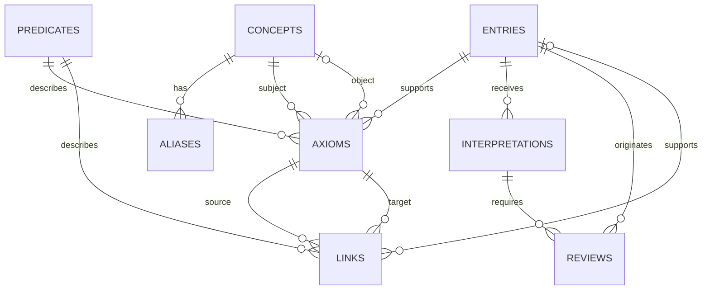

# Database

The migrations define the intended PostgreSQL model, but functional stores are not connected yet.
Runtime knowledge remains in memory; only inference telemetry is currently persisted.

Lectura rápida:

- Una `Entry` puede generar varias `Interpretations` y respaldar muchos `Axioms`.
- Un `Concept` puede ser sujeto u objeto de numerosos `Axioms`.
- Un `Axiom` siempre tiene un `Predicate`.
- Un `Link` conecta exactamente dos `Axioms` y también tiene un `Predicate`.
- La procedencia de un `Link` puede ser una `Entry` o una inferencia respaldada por otros `Axioms`.
- Una `Interpretation` puede producir varias `Reviews`, cada una con una resolución genérica de
  referencia, un Concept propuesto, candidatos y una decisión humana opcional.
- `Interpretation` conserva estado, intentos, Draft, publicación y datos de la cola.
- `aliases` pertenece directamente a `Concept`.
- `pgmigrations` queda fuera porque es una tabla técnica aislada.
- `telemetry.runs` vive en un schema separado y no forma parte del estado funcional.

Los identificadores son texto porque el dominio no exige UUID. Los valores estructurados usan
`JSONB` únicamente cuando su forma se valida nuevamente al rehidratar las entidades.
