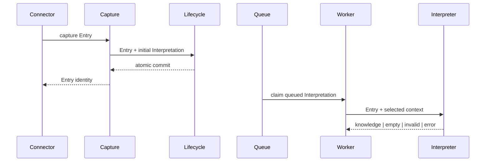
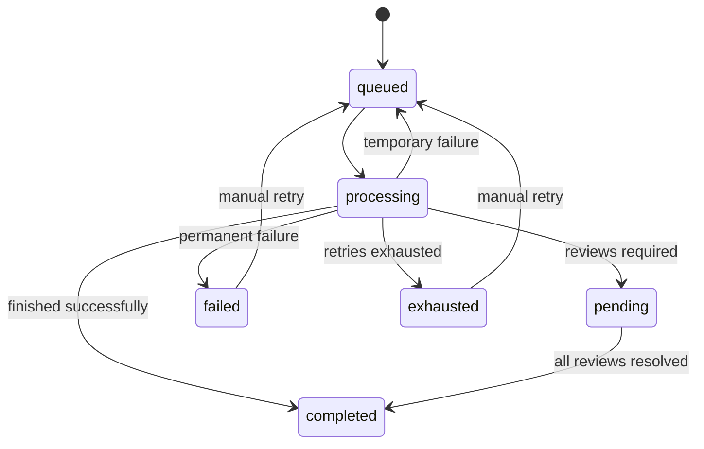
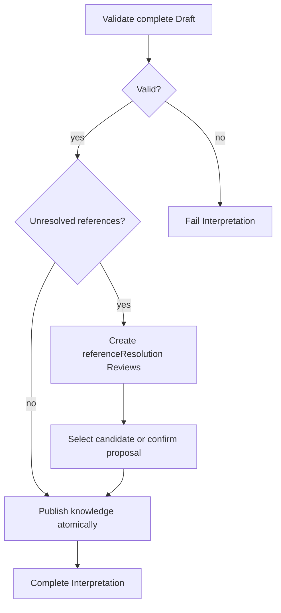
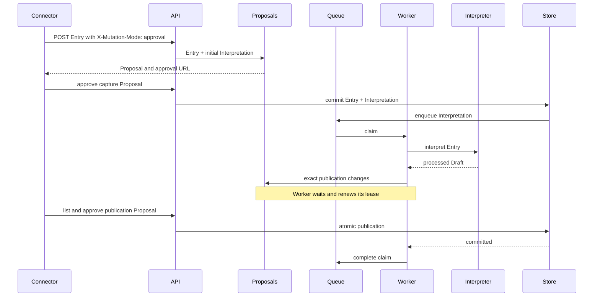
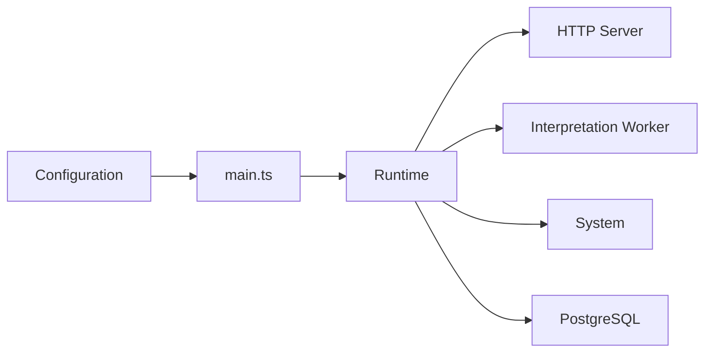

# Flows

## Capture and asynchronous processing

The Connector receives either an Entry identity or a Proposal immediately. Once committed, the
queued Interpretation continues asynchronously with selected context.

## Interpretation state

Temporary failures return to the queue, unresolved Concept references wait for human review, and
permanent outcomes preserve their final state.

## Review and publication

The complete Draft is validated first. An uncertain Concept reference may be requested explicitly
by inference or detected automatically while matching Concepts. Both paths create the same
`referenceResolution` Review and pause publication until every reference is resolved. Proposed
Concepts declare `referenceStatus`; `uncertain` is invalid without a matching resolution request.
Existing context Concepts can be referenced directly by ID.

Generic unnamed-person placeholders are treated as uncertain even if the provider labels them as identified, so claims about an unknown author or creator cannot silently create a canonical person.

Knowledge is never partially published. The final Review, publication, and completed
Interpretation share one atomic operation.

Each Review contains one reference, a human-readable question, the proposed Concept and zero or
more existing Concept candidates. `POST /api/reviews/:id/resolution` selects a candidate by
`selectedConceptId`; omitting it confirms the proposed Concept. Review decisions cannot be supplied
by the Interpreter inside its Draft.

Provider transport, throttling and server failures may be retried automatically. Generated output
that violates the structured schema fails immediately because repeating the same deterministic
contract error is not treated as provider unavailability. When a provider supplies `Retry-After`, the worker respects that delay before the next configured attempt.

External statements may remain exact `quote` Literals without resolving their author. A Review is
required only when an uncertain author or entity is used as a Concept reference. Predicate keys are
supplied with their allowed Axiom/Link usage. Text Entries accept paragraph locators only; URL
Entries currently accept none.

## Mutation control

Mutation is controlled at two independent boundaries:

- `X-Mutation-Mode` controls the current HTTP request and defaults to `readonly`.
- `MUTATION_MODE` controls background Interpretation mutations and defaults to `approval`.

Both use the same in-memory Proposal registry when their effective mode is `approval`.
Resolving a Review is a user mutation: in HTTP `approval` mode it creates a Proposal immediately,
and approving that Proposal performs the resolution and any resulting atomic publication. It does
not create a second background-publication Proposal.

Rejecting the asynchronous Proposal releases the waiting worker as a failed Interpretation.
Pending Proposals have no timer and disappear when approved, rejected, or when the process stops.

## Runtime lifecycle

`main.ts` only composes dependencies and delegates process lifecycle to `Runtime`.

The HTTP lifecycle is framework-independent at this boundary. PostgreSQL currently stores inference
telemetry; functional knowledge remains in memory.
