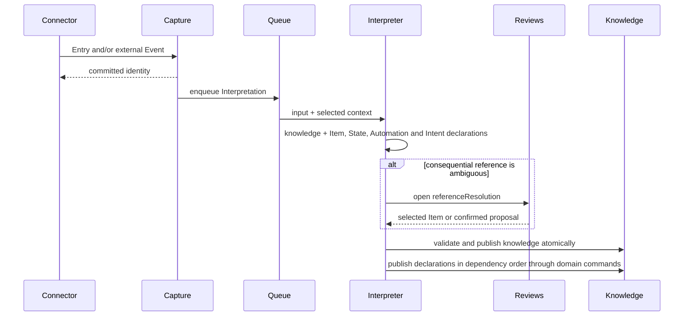
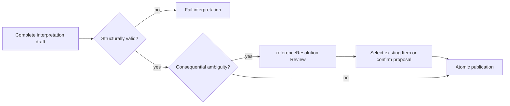
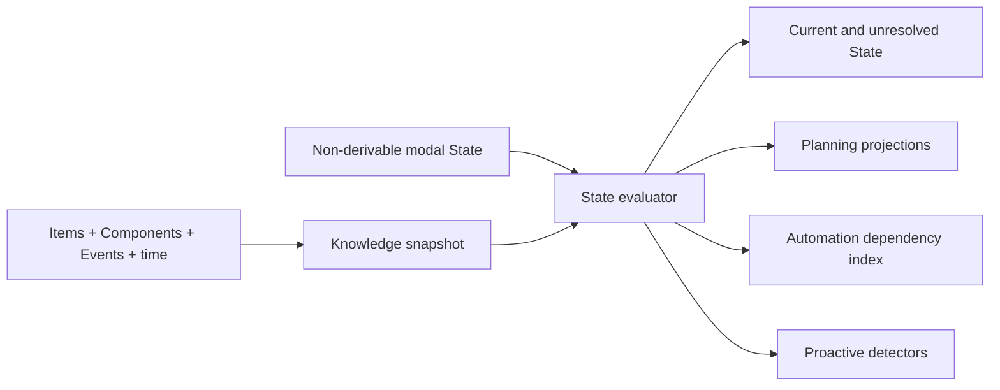
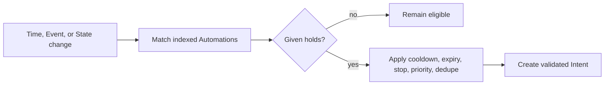
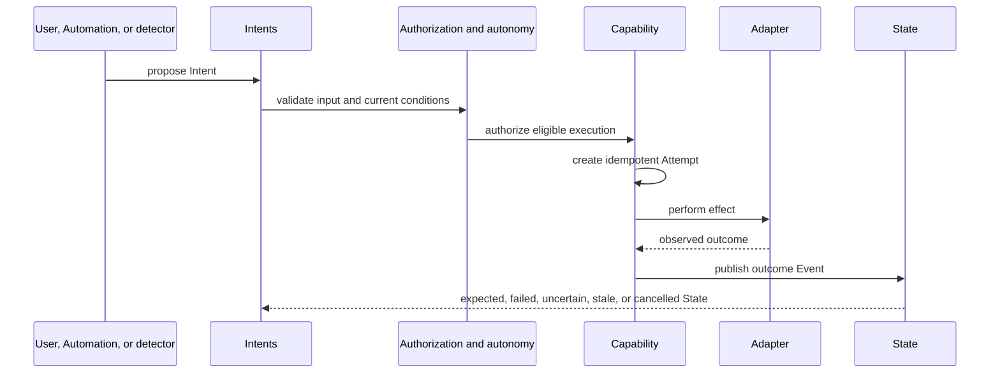
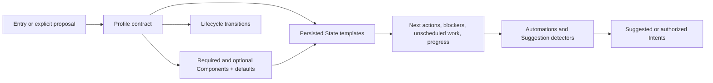
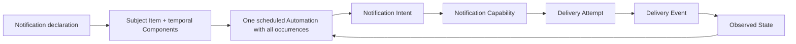
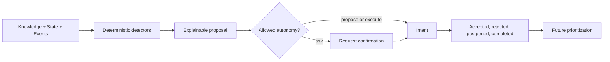
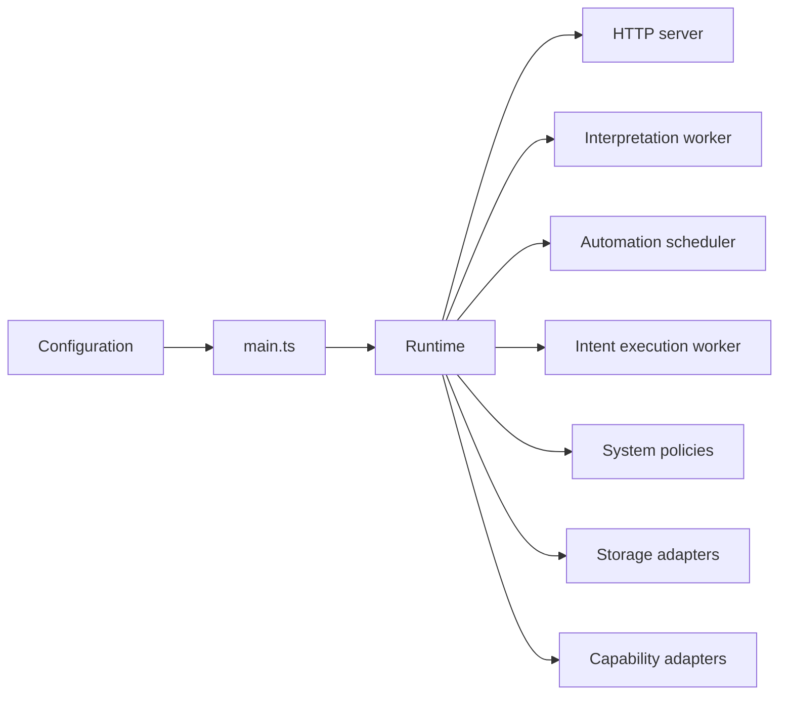

# Flows

Target runtime decisions. Implementation gaps require explicit OpenSpec changes.

## Capture, interpretation, and publication

One input may create both an immutable Entry and an Event. Publication is always atomic.

Simple connections use typed references; relationships requiring their own evidence or history are Items.

## Review and conflict resolution

`referenceResolution` resolves identity ambiguity, not mutation approval. Conflicting evidence is preserved.
Pending Reviews SHALL remain visible to the launcher until resolved.

## Knowledge and State evaluation

Knowledge emerges from Items and Components. State may be observed, believed, desired, required, forbidden, or predicted.

State is derived by default and persisted only when it cannot be reconstructed.

## Declarative Automation evaluation

Automations use closed `Given / When / Then` declarations and never call Capabilities directly.

## Intent execution and observation

Intent proposes; Capability executes; Attempt records the try; Event records the outcome.

Conditions are reevaluated before every Attempt. A Capability's safety ceiling always limits autonomy.

## Profile composition and task planning

Tasks, objectives, plans, and habits are Item compositions, not separate storage models.

## Launcher notifications

Deadline and notification cadence are independent.

The launcher uses `/api/notifications`. Reads derive and compact delivered, unacknowledged notices from Automations, Intents and Events. Acknowledgement records an Event and never completes the subject.

## Retry policy

Each operation allows at most three attempts. Transient outages use 1/5 minute delays, quota uses 15/60 minute lower bounds and honors provider timing, and invalid output uses 10/60 second delays. Authentication and configuration fail immediately; no target fallback occurs.

## Proactive assistance

Every Suggestion carries evidence, rationale, urgency, and expiration.

Inference may structure or rank proposals, but cannot mutate or execute directly.

## Runtime lifecycle

`main.ts` delegates lifecycle to `Runtime`; infrastructure remains behind ports.
Production runs as one long-lived Railway service; HTTP, interpretation, scheduling and execution stay in the same process.

