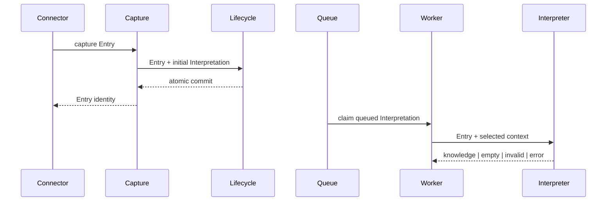
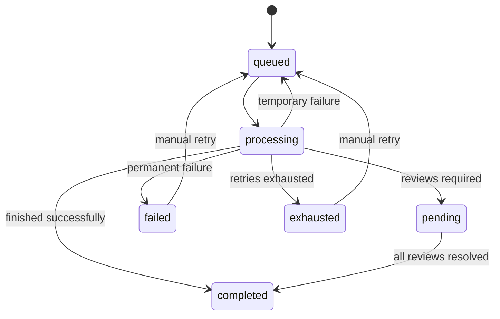
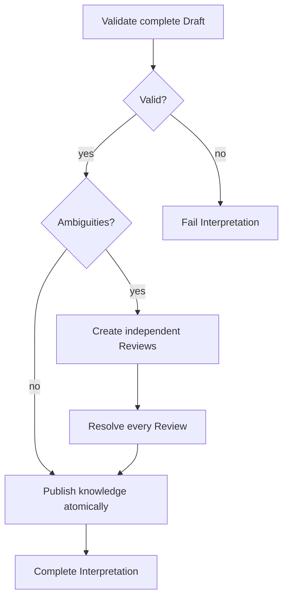
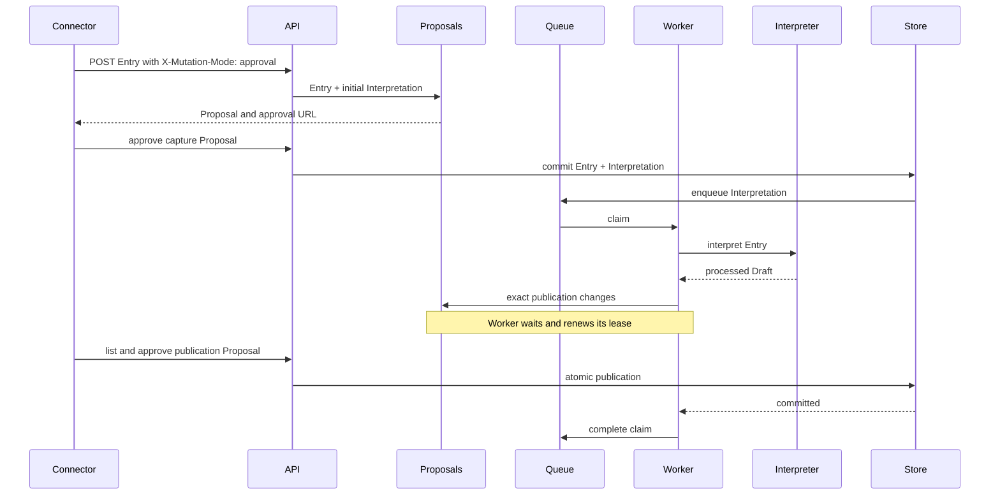
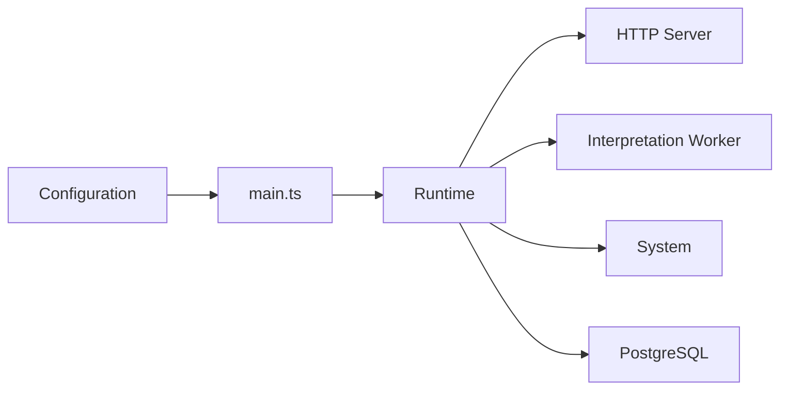

# Flows

## Capture and asynchronous processing

The Connector receives either an Entry identity or a Proposal immediately. Once committed, the
queued Interpretation continues asynchronously with selected context.

## Interpretation state

Temporary failures return to the queue, ambiguities wait for human review, and permanent outcomes preserve their final state.

## Review and publication

The complete Draft is validated first; any ambiguity pauses publication until every Review is resolved, then all knowledge is committed atomically.

Knowledge is never partially published. The final Review, publication, and completed
Interpretation share one atomic operation.

## Mutation control

Mutation is controlled at two independent boundaries:

- `X-Mutation-Mode` controls the current HTTP request and defaults to `readonly`.
- `MUTATION_MODE` controls background Interpretation mutations and defaults to `approval`.

Both use the same in-memory Proposal registry when their effective mode is `approval`.

Rejecting the asynchronous Proposal releases the waiting worker as a failed Interpretation.
Pending Proposals have no timer and disappear when approved, rejected, or when the process stops.

## Runtime lifecycle

`main.ts` only composes dependencies and delegates process lifecycle to `Runtime`.

The HTTP lifecycle is framework-independent at this boundary. PostgreSQL currently stores inference
telemetry; functional knowledge remains in memory.
