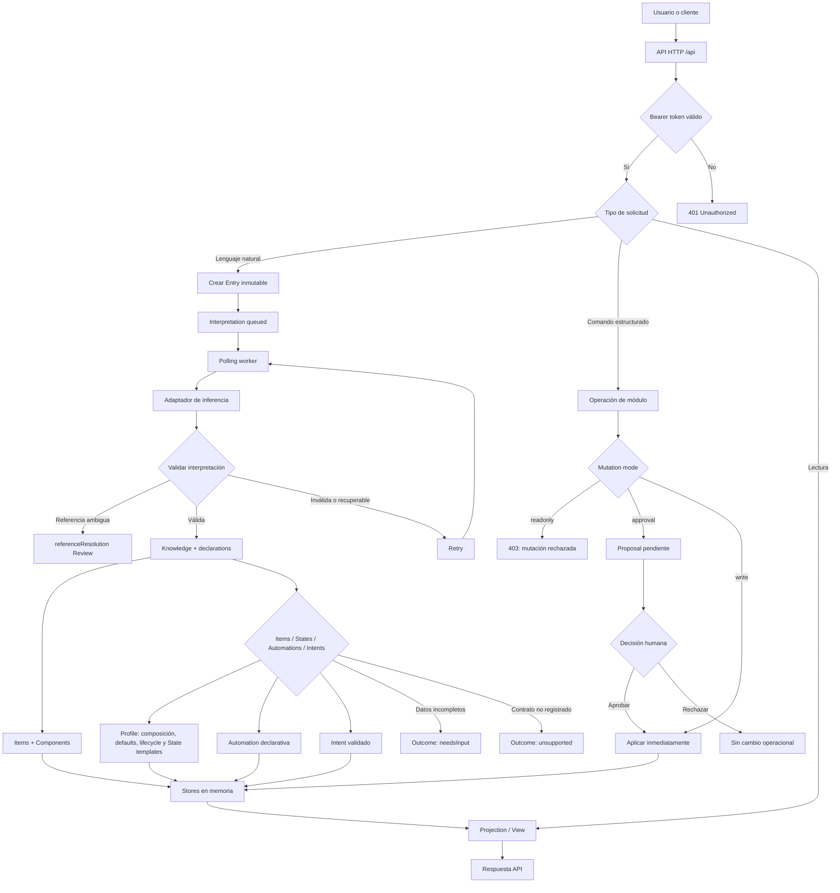

### General system flow

```mermaid
flowchart TD
    U["Usuario o cliente"] --> API["API HTTP /api"]
    API --> AUTH{"Bearer token válido"}
    AUTH -- Sí --> ROUTE{"Tipo de solicitud"}
    AUTH -- No --> ERR401["401 Unauthorized"]

    ROUTE -->|Lenguaje natural| ENTRY["Crear Entry inmutable"]
    ROUTE -->|Comando estructurado| MUTATION["Operación de módulo"]
    ROUTE -->|Lectura| QUERY["Projection / View"]

    ENTRY --> QUEUE["Interpretation queued"]
    QUEUE --> WORKER["Polling worker"]
    WORKER --> MODEL["Adaptador de inferencia"]
    MODEL --> VALIDATE{"Validar interpretación"}
    VALIDATE -- Referencia ambigua --> REVIEW["referenceResolution Review"]
    VALIDATE -- Válida --> DRAFT["Knowledge + declarations"]
    VALIDATE -- Inválida o recuperable --> RETRY["Retry"]
    RETRY --> WORKER

    DRAFT --> KNOWLEDGE["Items + Components"]
    DRAFT --> DECLARATIONS{"Items / States / Automations / Intents"}
    DECLARATIONS --> PROFILE["Profile: composición, defaults, lifecycle y State templates"]
    DECLARATIONS --> AUTOMATION["Automation declarativa"]
    DECLARATIONS --> INTENT["Intent validado"]
    DECLARATIONS -->|Datos incompletos| NEEDSINPUT["Outcome: needsInput"]
    DECLARATIONS -->|Contrato no registrado| UNSUPPORTED["Outcome: unsupported"]

    MUTATION --> MODE{"Mutation mode"}
    MODE -- readonly --> DENIED["403: mutación rechazada"]
    MODE -- approval --> PROPOSAL["Proposal pendiente"]
    MODE -- write --> APPLY["Aplicar inmediatamente"]
    PROPOSAL --> DECISION{"Decisión humana"}
    DECISION -- Aprobar --> APPLY
    DECISION -- Rechazar --> REJECTED["Sin cambio operacional"]

    KNOWLEDGE --> STORE["Stores en memoria"]
    PROFILE --> STORE
    AUTOMATION --> STORE
    INTENT --> STORE
    APPLY --> STORE
    STORE --> QUERY
    QUERY --> RESPONSE["Respuesta API"]
```
