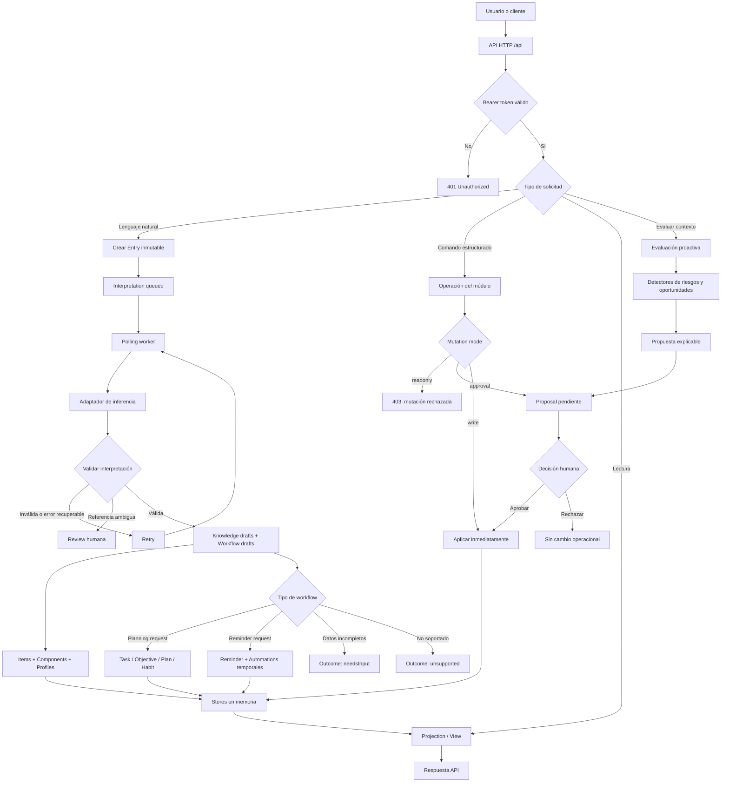

### General system flow

```mermaid
flowchart TD
    U["Usuario o cliente"] --> API["API HTTP /api"]

    API --> AUTH{"Bearer token válido"}
    AUTH -- No --> ERR401["401 Unauthorized"]
    AUTH -- Sí --> ROUTE{"Tipo de solicitud"}

    ROUTE -->|Lenguaje natural| ENTRY["Crear Entry inmutable"]
    ROUTE -->|Comando estructurado| MUTATION["Operación del módulo"]
    ROUTE -->|Lectura| QUERY["Projection / View"]
    ROUTE -->|Evaluar contexto| PROACTIVE["Evaluación proactiva"]

    ENTRY --> QUEUE["Interpretation queued"]
    QUEUE --> WORKER["Polling worker"]
    WORKER --> MODEL["Adaptador de inferencia"]
    MODEL --> VALIDATE{"Validar interpretación"}

    VALIDATE -- Inválida o error recuperable --> RETRY["Retry"]
    RETRY --> WORKER
    VALIDATE -- Referencia ambigua --> REVIEW["Review humana"]
    VALIDATE -- Válida --> DRAFTS["Knowledge drafts + Workflow drafts"]

    DRAFTS --> KNOWLEDGE["Items + Components + Profiles"]
    DRAFTS --> WORKFLOW{"Tipo de workflow"}
    WORKFLOW -->|Planning request| PLANNING["Task / Objective / Plan / Habit"]
    WORKFLOW -->|Reminder request| REMINDER["Reminder + Automations temporales"]
    WORKFLOW -->|Datos incompletos| NEEDS_INPUT["Outcome: needsInput"]
    WORKFLOW -->|No soportado| UNSUPPORTED["Outcome: unsupported"]

    MUTATION --> MODE{"Mutation mode"}
    MODE -- readonly --> DENIED["403: mutación rechazada"]
    MODE -- approval --> PROPOSAL["Proposal pendiente"]
    MODE -- write --> APPLY["Aplicar inmediatamente"]

    PROPOSAL --> DECISION{"Decisión humana"}
    DECISION -- Aprobar --> APPLY
    DECISION -- Rechazar --> REJECTED["Sin cambio operacional"]

    PLANNING --> STORE["Stores en memoria"]
    REMINDER --> STORE
    KNOWLEDGE --> STORE
    APPLY --> STORE

    PROACTIVE --> DETECTORS["Detectores de riesgos y oportunidades"]
    DETECTORS --> EXPLAIN["Propuesta explicable"]
    EXPLAIN --> PROPOSAL

    STORE --> QUERY
    QUERY --> RESPONSE["Respuesta API"]
```
